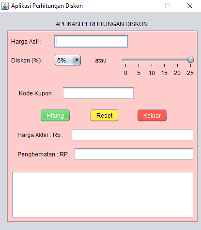
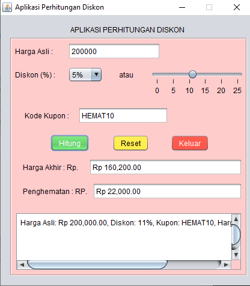

# AplikasiPerhitunganDiskon
Tugas 3 - Ita Khairati 2310010219

# 🧮 Proyek Akhir Pemrograman Berbasis Objek 1

Proyek ini adalah contoh sederhana aplikasi **Aplikasi Perhitungan Diskon Barang** menggunakan **Java GUI (JFrame Form)** sebagai tugas akhir dari mata kuliah **Pemrograman Berbasis Objek 1**.

---

## 📘 Deskripsi

Aplikasi ini digunakan untuk menghitung harga akhir setelah diskon diberikan pada suatu barang.  
Pengguna dapat memilih persentase diskon melalui **ComboBox** atau **Slider**, memasukkan **kode kupon**, dan melihat hasil akhir beserta **jumlah penghematan**.  

Aplikasi ini mengimplementasikan konsep-konsep penting dalam **Pemrograman Berorientasi Objek (OOP)** seperti:

- Class dan Object  
- Atribut dan Method  
- Constructor  
- Encapsulation  
- Event Handling  
- GUI (Swing)  
- Error Handling  
- dan Polymorphism (melalui overriding method event handler)

---

## ⚙️ Penjelasan Kode

### 1. Class
```java
public class DiskonForm extends javax.swing.JFrame { ... }
```
Class ini merupakan turunan dari `JFrame` yang digunakan untuk membuat tampilan antarmuka grafis (GUI) menggunakan **Swing**.

---

### 2. Object
Object dibuat otomatis ketika program dijalankan:
```java
new DiskonForm().setVisible(true);
```

---

### 3. Atribut
Atribut digunakan untuk menyimpan komponen dan data pengguna:
```java
private javax.swing.JButton btnHitung, btnReset, btnKeluar;
private javax.swing.JComboBox<String> cmbDiskon;
private javax.swing.JSlider sldDiskon;
private javax.swing.JTextField txtHargaAsli, txtKupon, txtHargaAkhir, txtHemat;
private javax.swing.JTextArea txtRiwayat;
```

---

### 4. Constructor
Digunakan untuk inisialisasi komponen dan pengaturan awal:
```java
public DiskonForm() {
    initComponents();
    setTitle("Aplikasi Perhitungan Diskon");
    setLocationRelativeTo(null);
    setResizable(false);
}
```

---

### 5. Mutator (Setter)
Mengubah nilai dari komponen GUI:
```java
cmbDiskon.addItem("5%");
cmbDiskon.addItem("10%");
```

---

### 6. Accessor (Getter)
Mengambil nilai dari input pengguna:
```java
double hargaAsli = Double.parseDouble(txtHargaAsli.getText());
```

---

### 7. Encapsulation
Atribut GUI bersifat **private** dan hanya diakses melalui method di dalam class `DiskonForm`.

---

### 8. Inheritance
Program mewarisi class `JFrame`:
```java
public class DiskonForm extends javax.swing.JFrame { ... }
```

---

### 9. Polymorphism (Event Handling / Overriding)
Pemakaian **event listener** (`addActionListener`) menggunakan **lambda expression**, yang mengubah perilaku tombol secara dinamis:
```java
btnHitung.addActionListener(e -> hitungDiskon());
```

---

### 10. Seleksi (Percabangan)
Digunakan untuk memeriksa **kode kupon**:
```java
if (kupon.equalsIgnoreCase("HEMAT10")) {
    hargaSetelahDiskon *= 0.9;
} else if (kupon.equalsIgnoreCase("DISKON5")) {
    hargaSetelahDiskon *= 0.95;
}
```

---

### 11. Perulangan
Tidak menggunakan `for`, tapi `addHoverEffect()` memanfaatkan **event loop internal** Swing (listener dipanggil berulang tiap interaksi).

---

### 12. IO Sederhana
Input dan output melalui GUI (TextField dan TextArea):
```java
txtHargaAsli.getText();
txtRiwayat.append("Harga Asli: Rp " + df.format(hargaAsli));
```

---

### 13. Error Handling
Menangani input yang tidak valid:
```java
try {
    double hargaAsli = Double.parseDouble(txtHargaAsli.getText());
} catch (NumberFormatException ex) {
    JOptionPane.showMessageDialog(this, "Masukkan harga asli dengan benar!", "Error", JOptionPane.ERROR_MESSAGE);
}
```

---

### 14. GUI Enhancement (Tambahan)
Tombol memiliki **warna berbeda dan efek hover**:
```java
addHoverEffect(btnHitung, new Color(76,175,80), new Color(56,142,60));  // hijau → hijau tua
addHoverEffect(btnReset, new Color(255,235,59), new Color(255,213,0));  // kuning → kuning tua
addHoverEffect(btnKeluar, new Color(244,67,54), new Color(211,47,47));  // merah → merah tua
```

---

## 🖥️ Cuplikan Tampilan GUI
| Tampilan Utama | Hasil Perhitungan |
|----------------|------------------|
|  |  |
```

---

## 👩‍💻 Pembuat

**Nama**  : Ita Khairati  
**NPM**   : 2310010219  
**Kelas** : 4BNR_PBO1  
**Judul** : *Aplikasi Perhitungan Diskon (Java GUI)*  
  


